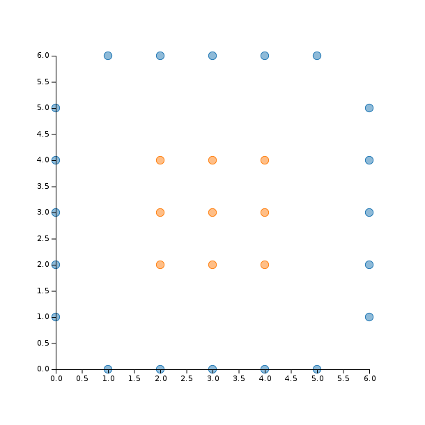
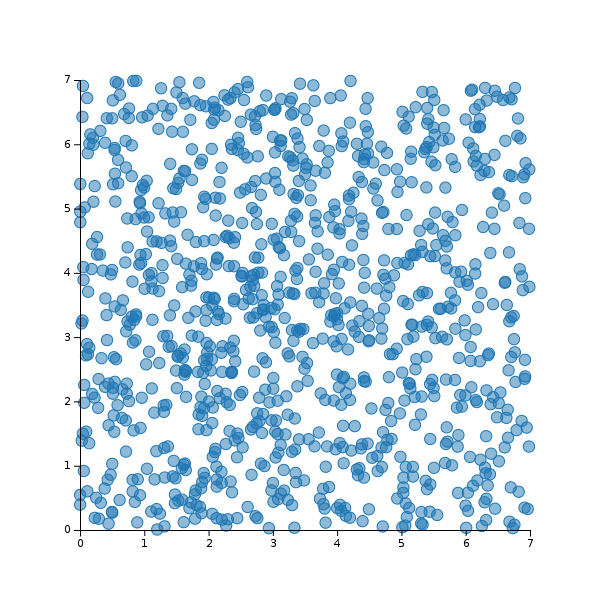
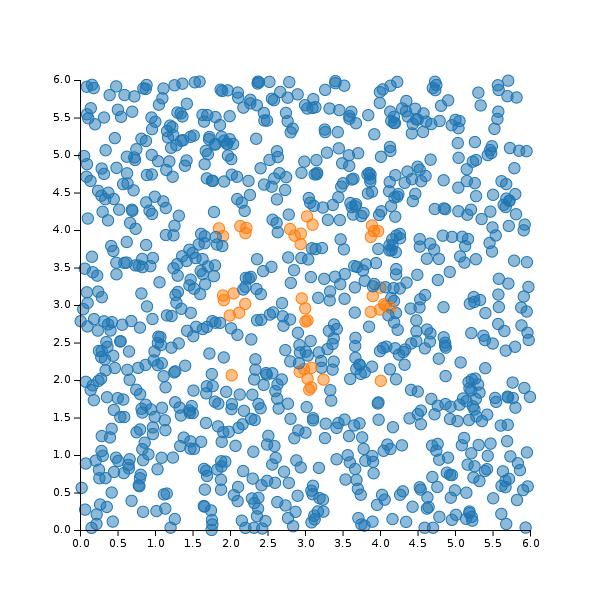
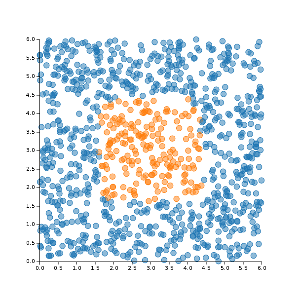

# KSVM

## Overview

This package implements Kernel SVM in julia. The quadratic optimisation problem is solved with `Ipopt` and
the following kernel functions are availables:
* Linear
* Polynomial
* Laplacian RBF
* RBF

## Installation

```julia
Pkg.clone("https://github.com/remusao/KSVM.jl.git")
Pkg.update()
```

## Usage

```julia
using Vega
using KSVM

# Declare data
x = [[0 0 0 0 0 1 1 2 2 2 2 2 3 3 3 3 3 4 4 4 4 4 5 5 6 6 6 6 6],
     [1 2 3 4 5 0 6 0 2 3 4 6 0 2 3 4 6 0 2 3 4 6 0 6 1 2 3 4 5]]

# Labels (-1 or +1)
y = [-1, -1, -1, -1, -1, -1, -1, -1, 1, 1, 1, -1, -1, 1, 1, 1, -1, -1, 1, 1, 1, -1, -1, -1, -1, -1, -1, -1, -1]

# Random data to test with unknown labels
data = rand(2, 1000) * 7

plot(x = reshape(x[1, :], size(x, 2)), y = reshape(x[2, :], size(x, 2)), group = y, kind = :scatter)
```



```julia
# Try with linear kernel
# This is the classic SVM algorithm
svm = train(x, y)
print_2Ddecision(svm, data)
```



```julia
# Try with a RBF kernel and different sigmas
# ex: 0.6 or 1.0
svm = train(x, y, rbf, sigma)
print_2Ddecision(svm, data)
```



